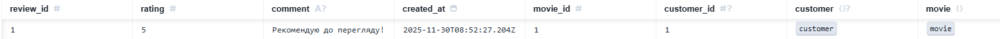
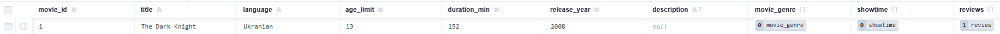
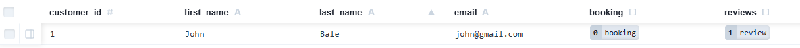

# Звіт по роботі з Prisma

## 1. Міграція: `add-review-table`

**Опис:** Додано нову модель `review` для відгуків про фільми та створено зв'язок "один-до-багатьох" з моделлю `customer` та `movie`.

**Зміни в `schema.prisma` (Фрагмент `Review`):**

```prisma
model review {
  review_id   Int       @id @default(autoincrement())
  rating      Int
  comment     String?
  created_at  DateTime  @default(now())
  movie_id    Int
  customer_id Int?
  customer    customer @relation(fields: [customer_id], references: [customer_id])
  movie       movie     @relation(fields: [movie_id], references: [movie_id])
}

// У моделі customer та movie додано:
   reviews review[]
```

**Згенерований `migration.sql`:**

```sql
-- CreateTable
CREATE TABLE "review" (
    "review_id" SERIAL NOT NULL,
    "rating" INTEGER NOT NULL,
    "comment" TEXT,
    "created_at" TIMESTAMP(3) NOT NULL DEFAULT CURRENT_TIMESTAMP,
    "movie_id" INTEGER NOT NULL,
    "customer_id" INTEGER,

    CONSTRAINT "review_pkey" PRIMARY KEY ("review_id")
);

-- AddForeignKey
ALTER TABLE "review" ADD CONSTRAINT "review_movie_id_fkey" FOREIGN KEY ("movie_id") REFERENCES "movie"("movie_id") ON DELETE RESTRICT ON UPDATE CASCADE;

-- AddForeignKey
ALTER TABLE "review" ADD CONSTRAINT "review_customer_id_fkey" FOREIGN KEY ("customer_id") REFERENCES "customer"("customer_id") ON DELETE SET NULL ON UPDATE CASCADE;
```

## 2. Міграція: `add-language-to-movie`

**Опис:** Додано поле `language` зі значенням за замовчуванням `Ukranian` до моделі `movie`.

**Зміни в `schema.prisma` (Фрагмент `movie`):**

```prisma
model movie {
  movie_id     Int           @id @default(autoincrement())
  title        String        @unique @db.VarChar(255)
  language     String        @default("Ukranian") @db.VarChar(50)
  age_limit    Int
  duration_min Int
  release_year Int
  description  String?
  movie_genre  movie_genre[]
  showtime     showtime[]
  reviews     review[]
}
```

**Згенерований `migration.sql`:**

```sql
-- AlterTable
ALTER TABLE "movie" ADD COLUMN     "language" VARCHAR(50) NOT NULL DEFAULT 'Ukranian';
```

## 3. Міграція: `drop-customer-phone`

**Опис:** Видален стовпець `phone` з моделі `customer`.

**Зміни в `schema.prisma` (Фрагмент `customer`):**

```prisma
model customer {
  customer_id Int       @id @default(autoincrement())
  first_name  String    @db.VarChar(100)
  last_name   String    @db.VarChar(100)
  email       String    @unique @db.VarChar(255)
  booking     booking[]
  reviews     review[]
}
```

**Згенерований `migration.sql`:**

```sql
-- AlterTable
ALTER TABLE "customer" DROP COLUMN "phone";
```

## 4. Перевірка результатів за допомогою Prisma Studio

### Команда запуску Studio:

```
npx prisma studio
```

## Докази коректності схеми та запитів:

## 1. Перевірка таблиці `review` та зв'язків

У Prisma Studio успішно створено новий запис у таблиці `review`, що підтверджує, що міграція `add-review-table` була успішною і зовнішні ключі `customer_id` та `movie_id` працюють.



## 2. Перевірка зміни таблиці `movie`

У таблиці `movie` з'явився новий стовпець `language` зі значення за замовчуванням, що підтвердує успішність міграції `add-language-to-movie`.



## 3. Перевірка зміни таблиці `customer`

Стовпець `phone` відсутній, що підтвердує успішність міграції `drop-customer-phone`.

